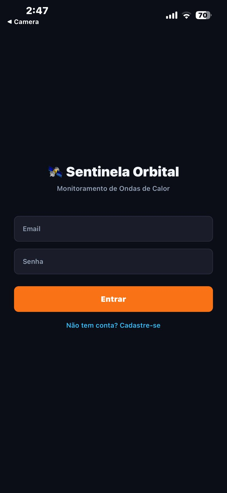
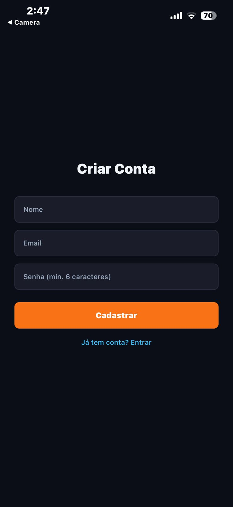
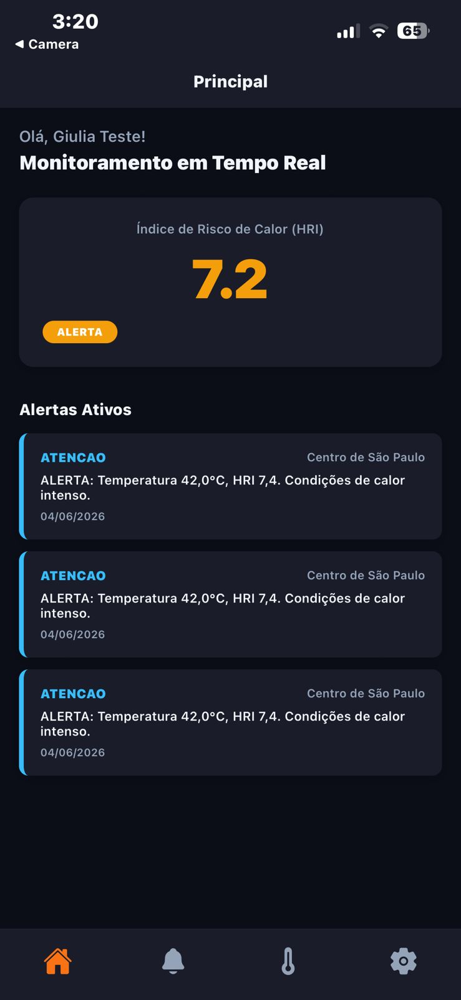
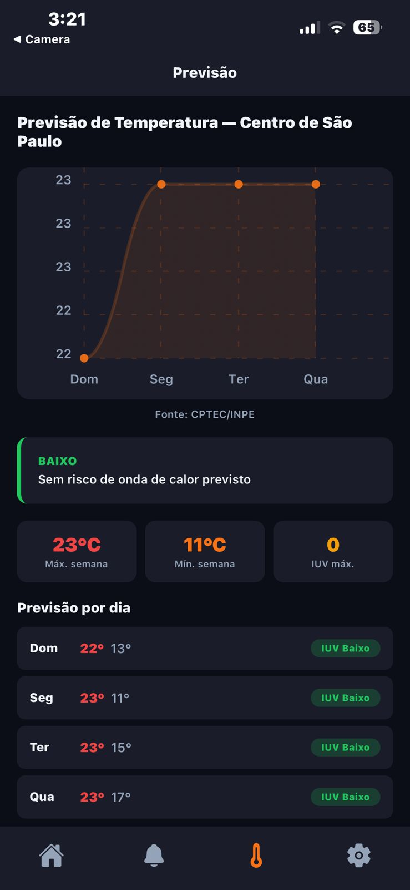
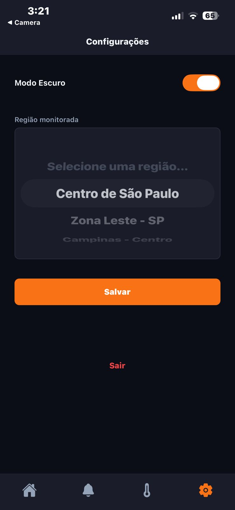
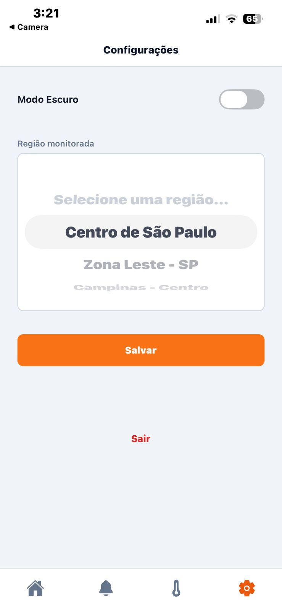
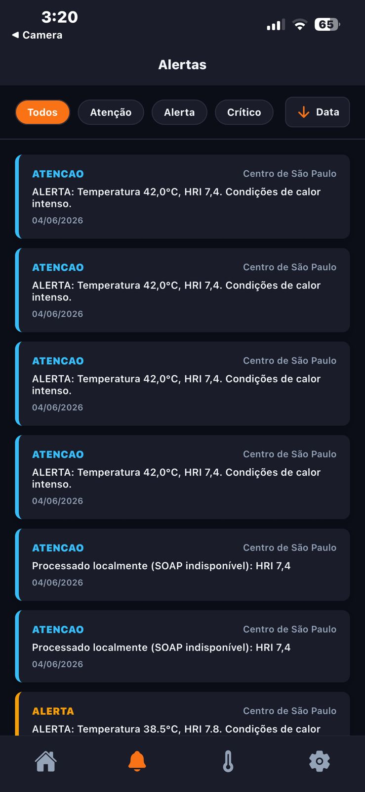
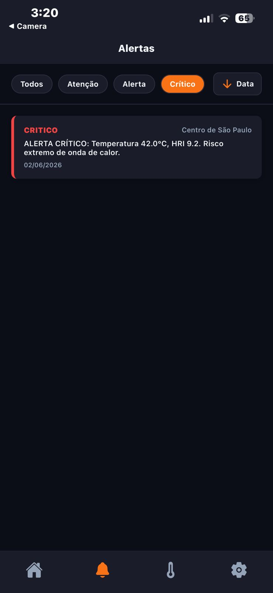
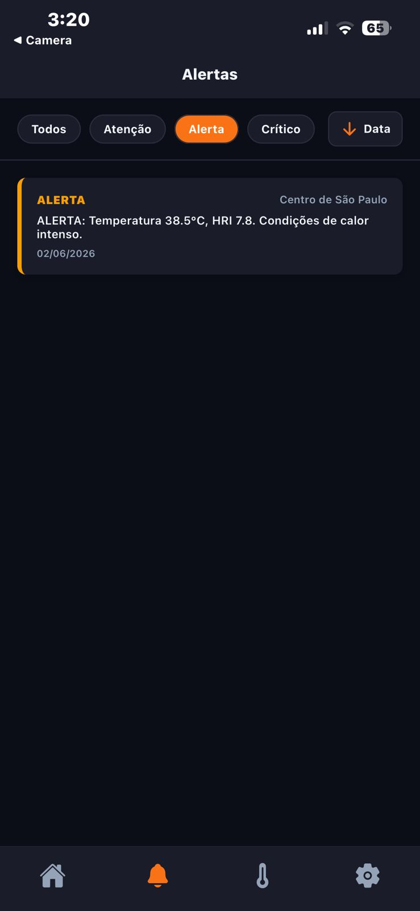

# 🛰️ Sentinela Orbital - Monitoramento Climático Inteligente

O **Sentinela Orbital** é uma solução mobile desenvolvida para o monitoramento e mitigação dos efeitos de ondas de calor em centros urbanos e áreas industriais. Utilizando dados provenientes de monitoramento satelital, o aplicativo fornece alertas em tempo real, previsões de risco e indicadores de saúde (Heat Risk Index).

## 🚀 Por que esta solução?

As ondas de calor tornaram-se um dos desafios climáticos mais críticos do século XXI, afetando diretamente a saúde pública e a eficiência industrial. 

**Como resolvemos o problema:**
- **Dados Espaciais:** Conectamos a aplicação a APIs que processam dados de satélites meteorológicos para identificar anomalias térmicas.
- **Prevenção Ativa:** Através de notificações e painéis visuais, a solução permite que gestores e cidadãos tomem medidas preventivas antes do pico de temperatura.
- **Integração com a Indústria:** Focado na Indústria Espacial, o projeto demonstra como a tecnologia de órbita terrestre baixa (LEO) pode ser aplicada diretamente na segurança climática terrestre.

---
## 📽️ Video Demonstrativo 
### [Link Video](https://drive.google.com/file/d/1B54eX6fDjepmVMxNAeGf7z2S77ulzm6z/view?usp=sharing)

---
## 📸 Demonstração da Interface

| Print da Tela | Título Descritivo |
| :--- | :--- |
|  | Tela de Autenticação e Boas-vindas |
|  | Tela de Cadastro de Usuário |
|  | Painel Principal com Indicador HRI e Alertas Ativos |
|  | Dashboard de Previsão Semanal com Gráfico de Temperatura |
|  | Ajustes de Região e Preferências de Usuário | 
|  | Ajustes de Região e Preferências de Usuário | 
|  | Histórico de Alertas para a região monitorada | 
|  | Filtro por intensidade do alerta | 
|  | Filtro por intensidade do alerta | 


---

## 🛠️ Tecnologias Utilizadas

- **Frontend:** React Native com Expo (TypeScript)
- **Navegação:** Expo Router
- **Estado Global:** Context API
- **Gráficos:** React Native Chart Kit
- **Estilização:** Design System customizado (Vanilla CSS/StyleSheet)
- **Persistência:** AsyncStorage
- **Backend:** Java/Spring Boot (Dockerizado)

---

## ⚙️ Como Rodar o Projeto

### 1. Requisitos Prévios
- Node.js instalado
- Docker e Docker Compose instalados
- Expo Go instalado no smartphone (para teste físico)

### 2. Rodando o Backend (API)
A aplicação depende de um backend para fornecer os dados climáticos.
```bash
# Navegue até a pasta do backend (onde está o docker-compose.yml)
cd caminho/para/seu/projeto-backend

# Suba os containers da aplicação e do banco de dados
docker compose up -d
```
O backend estará disponível em `http://localhost:8080`.

### 3. Rodando o Mobile (Sentinela Orbital)
```bash
# Instale as dependências
npm install

# Inicie o servidor do Expo
npx expo start
```
- Utilize o QR Code gerado para abrir no **Expo Go**.
- Certifique-se de que o seu celular e o computador estão na **mesma rede Wi-Fi**.
- Altere o IP em `src/constants/config.ts` para o IP da sua máquina local.

---


## 👥 Desenvolvido por:
- Gabriel Danius - RM 555747
- Caio Rossini - RM 555084
- Giulia Rocha- RM 558084
- Carlos Eduardo - RM 556785
